# Datadog Agent Skills & SE Demo Kit

Portable agent skills and demo scenarios for Datadog — built for Sales Engineers who live in the terminal and work with AI coding assistants.

<p align="center">
  
</p>

## What's Here

### Agent Skills (`skills/`)

12 portable skills that wrap Datadog's existing CLIs (`pup`, `datadog-ci`) for use across AI coding assistants:

| Skill | Wraps | Purpose |
|---|---|---|
| `datadog-metrics` | `pup metrics` | Submit, query, and manage metrics |
| `datadog-logs` | `pup logs` | Search, tail, and analyze logs |
| `datadog-monitors` | `pup monitors` | Create and manage alerts |
| `datadog-apm` | `pup` + API | Distributed tracing and profiling |
| `datadog-synthetics` | `datadog-ci synthetics` | API and browser tests |
| `datadog-incidents` | `pup incidents` | Incident lifecycle management |
| `datadog-security` | `pup` + API | SIEM, CSPM, vulnerability management |
| `datadog-ai-observability` | `pup` + API | LLM Observability, AI agent monitoring |
| `datadog-ci-visibility` | `datadog-ci` | Pipeline traces, DORA metrics, quality gates |
| `datadog-demo` | Demo engine | Run pre-built demo scenarios |
| `datadog-competitive` | — | Competitive positioning reference |
| `datadog-se-demo` | — | Demo structure and presentation framework |

**Compatible with:** Claude Code, Codex CLI, pi, OpenCode, Cursor

### Demo Scenarios (`demos/`)

Pre-built, offline-capable demo scenarios that simulate realistic Datadog investigations. Each follows the SE demo framework: **Problem → Brute Force → Datadog Solution → Differentiator → Business Outcome.**

| Scenario | Vertical | Territory |
|---|---|---|
| `checkout-latency-spike` | Retail | Walmart/AT&T corridor (AR/TX) |
| `oil-rig-iot-anomaly` | Energy | Houston corridor (TX/LA) |
| `hipaa-compliance-drift` | Healthcare | Texas Medical Center (TX) |
| `llm-hallucination-detection` | Technology | Austin corridor (TX) |
| `fedramp-security-posture` | Defense | Fort Worth corridor (TX) |

```bash
# Run a demo
node demos/checkout-latency-spike.js

# Presentation mode (pauses + talking points)
node demos/llm-hallucination-detection.js --present
```

## Quick Start

### Install Skills (Claude Code)

```bash
# Symlink all skills into your Claude Code skills directory
./scripts/install-skills.sh claude-code

# Or manually:
ln -s $(pwd)/skills/datadog-metrics ~/.claude/skills/datadog-metrics
```

### Install Skills (Other Agents)

```bash
# pi — add to AGENTS.md
echo "Skills: $(pwd)/skills/" >> AGENTS.md

# OpenCode — symlink into .opencode/skills/
./scripts/install-skills.sh opencode
```

### Prerequisites

- [pup CLI](https://github.com/DataDog/pup) — `brew install datadog-labs/pack/pup`
- [datadog-ci](https://github.com/DataDog/datadog-ci) — `npm i -g @datadog/datadog-ci`
- Node.js 18+ (for demo scenarios)

## Design Philosophy

- **Wraps existing CLIs** — Skills use `pup` and `datadog-ci`, not a custom CLI
- **Portable** — Same skill folder works across Claude Code, Codex, pi, OpenCode, Cursor
- **Offline demos** — Demo scenarios generate sample data, no Datadog account needed
- **Customer-first** — Every demo follows Pain → Solution → Outcome, not feature dumps

## Architecture

Based on patterns from [steipete/agent-scripts](https://github.com/steipete/agent-scripts) (CLI-first, MCP-optional) and [badlogic/pi-skills](https://github.com/badlogic/pi-skills) (portable SKILL.md with `{baseDir}` placeholders).

```
skills/           → Agent skill definitions (SKILL.md + optional scripts)
demos/            → Demo scenario scripts (Node.js, zero deps)
scripts/          → Cross-agent installation scripts
```

## License

MIT
